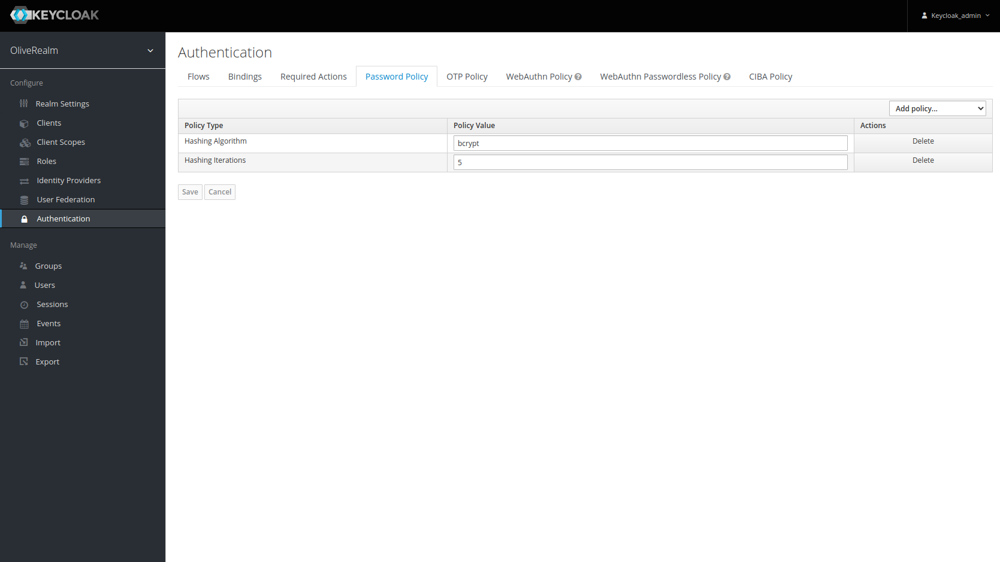
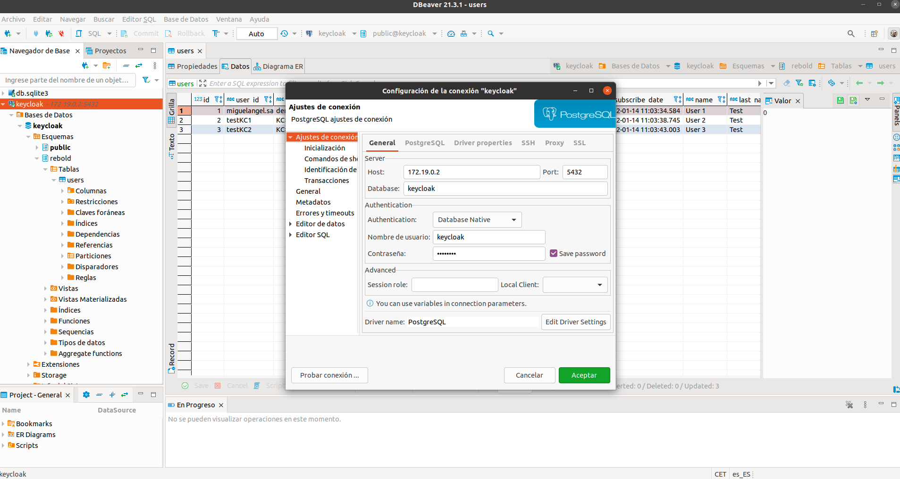

# Description

Deploy a keycloak service with PostgreSQL Database and BCrypt Password Hash Provider module installed.

## Start service

To start the keycloak service using PostgreSQL execute this command:

```shell
docker-compose up
```

## Configurations

We must create a new Password Policy including:
- Hashing Algorithm: bcrypt
- Hashing Iterations: 5 (for example)



## Configure DBeaver PostgreSQL connection

To get the IP Address of our PostgreSQL service to configure connect the DBeaver connection execute this command:


```shell
docker inspect -f '{{range .NetworkSettings.Networks}}{{.IPAddress}}{{end}}' <DOCKER_ID>

```

Configure DBeaver Connection like this:

